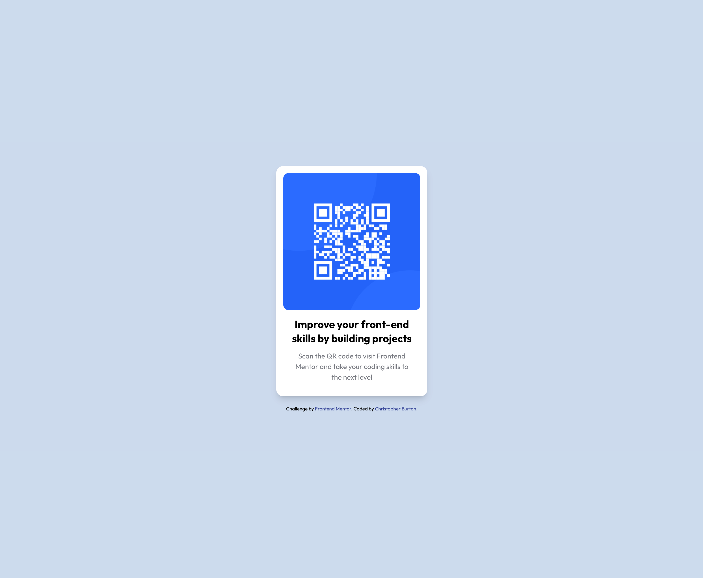

# Frontend Mentor - QR code component solution

## Table of contents

- [Overview](#overview)
  - [Screenshot](#screenshot)
  - [Links](#links)
- [My process](#my-process)
  - [Built with](#built-with)
- [Author](#author)

## Overview

### Screenshot

### Links

- Solution URL: [QR code component challenge on Frontend Mentor](https://www.frontendmentor.io/challenges/qr-code-component-iux_sIO_H)
- Live Site URL: [Frontend Mentor | QR Code Project](https://sparksyndrome.github.io/frontend-mentor-qrcode/)

## My process

- Wrote HTML.
- Wrote CSS section by section, using tailwindcss.

### Built with

- Semantic HTML5 markup
- CSS custom properties
- Flexbox
- Mobile-first workflow
- [tailwindcss](https://tailwindcss.com/) - framework

## Author

- GitHub - [Christopher Burton](https://www.github.com/SparkSyndrome)
- Frontend Mentor - [@SparkSyndrome](https://www.frontendmentor.io/profile/SparkSyndrome)
